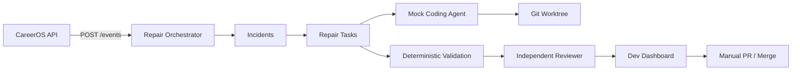

# Automated Repair System

Local MVP for structured error capture, incident grouping, repair tasks, agent adapters, deterministic validation, independent review, and developer dashboard handoff.

## Goals (MVP)

1. Capture structured CareerOS application errors
2. Group duplicates into incidents
3. Create local repair tasks with diagnostic context
4. Assign work to a coding agent on an isolated git branch/worktree
5. Run deterministic validation
6. Send patches to a separate review agent
7. Produce review reports and PR drafts
8. Require manual approval before merge or deployment

**Not implemented in this phase:** autonomous merge, production deployment, GitHub integration, canary rollout.

## Repository fit

| Area | Choice |
|------|--------|
| Orchestrator language | Python FastAPI (matches API stack) |
| Persistence | SQLite (`tools/repair-orchestrator/data/repair.db`) |
| Error source (MVP) | Unhandled API exceptions + demo scraper route |
| Dashboard | Next.js dev-only page at `/dev/repair` |
| Containers | Optional `docker-compose.repair.yml` |

CareerOS continues to run normally when `CAREER_OS_REPAIR_ENABLED=false` (default).

## Architecture



## Local setup

### 1. Start orchestrator

```bash
pnpm repair:up
# or without Docker:
pnpm repair:dev
```

### 2. Enable API integration

Add to `apps/api/.env`:

```env
CAREER_OS_REPAIR_ENABLED=true
CAREER_OS_REPAIR_DEMO_ENABLED=true
CAREER_OS_REPAIR_ORCHESTRATOR_URL=http://127.0.0.1:8090
```

### 3. Start CareerOS

```bash
pnpm dev
```

### 4. Open dashboard

http://localhost:3000/dev/repair (development only)

## Docker commands

```bash
docker compose -f docker-compose.repair.yml up --build
docker compose -f docker-compose.repair.yml down
```

## Error event schema

```json
{
  "timestamp": "ISO-8601",
  "severity": "error",
  "service": "career-os-api",
  "environment": "local",
  "errorType": "DemoScraperFailure",
  "message": "Sanitized message",
  "stackTrace": "Sanitized stack",
  "correlationId": "uuid",
  "endpoint": "GET /dev/demo/unhandled-scraper-error",
  "gitCommitSha": "abc123",
  "applicationVersion": "0.1.0",
  "sourceLocation": "apps/api/app/routers/repair_demo.py:10",
  "feature": "scraper",
  "metadata": { "demo": true },
  "causedBy": null
}
```

Sensitive fields (passwords, tokens, resumes, profile content) are redacted before storage.

## Task lifecycle

`detected → triaged → ready_for_agent → implementing → validating → review_required → approved/rejected → ready_for_human → closed`

Failures move tasks to `failed` or `rejected` explicitly.

## Agent adapter contract

```ts
interface CodingAgentAdapter {
  start(task: RepairTask, workspace: AgentWorkspace): Promise<AgentRun>;
  getStatus(runId: string): Promise<AgentRunStatus>;
  cancel(runId: string): Promise<void>;
}
```

MVP implementation: `MockCodingAgentAdapter` in `tools/repair-orchestrator/src/repair_orchestrator/agents/mock_adapter.py`.

Future adapters: Cursor CLI, Codex CLI, Claude Code, Aider, OpenHands.

## Safety boundaries

Configured in `repair_orchestrator/config.py`:

- Max changed files / diff size / execution time / retries
- Protected directories (`.env`, `.github`, migrations, manifest, billing, etc.)
- Required human-review categories (database, auth, privacy, extension permissions, resume processing, job applications)
- No automatic push, merge, or deploy

Agents must not read secrets, modify git history, force-push, merge, deploy, disable tests, broaden extension permissions, or modify user data.

## Trigger demonstration incident

```bash
curl -i http://127.0.0.1:8000/dev/demo/unhandled-scraper-error
```

Run twice to meet the default `min_occurrences_for_task=2` threshold.

## Inspect proposed patch

1. Dashboard → task card → agent branch / worktree path
2. `git -C .repair-worktrees/<id> diff`
3. PR draft in task details (not pushed remotely unless explicitly configured)

## Cleanup

```bash
git worktree list
git worktree remove .repair-worktrees/<id>
git branch -D repair/<task-id>-<slug>
```

## Configuration

| Variable | Default | Purpose |
|----------|---------|---------|
| `CAREER_OS_REPAIR_ENABLED` | `false` | API forwarding + middleware |
| `CAREER_OS_REPAIR_DEMO_ENABLED` | `false` | Demo exception route |
| `CAREER_OS_REPAIR_ORCHESTRATOR_URL` | `http://127.0.0.1:8090` | Orchestrator base URL |
| `MIN_OCCURRENCES_FOR_TASK` | `2` | Threshold before auto task |
| `REPAIR_VALIDATION_COMMANDS` | typecheck + targeted pytest | Deterministic gates |

## Current limitations

- Mock coding agent only (no live Cursor/Codex CLI wiring)
- Mock reviewer (rule-based, not LLM)
- No remote PR creation (`allow_remote_pr=false`)
- Single error path MVP (API unhandled / demo scraper)
- No production dashboard exposure
- Validation runs host shell commands (requires local toolchain)

## Future phase (documented only)

- GitHub issue/PR integration
- Preview deployments
- Traffic replay against baseline/candidate
- Canary rollout (1% → 5% → 25% → 100%)
- Automated rollback thresholds
- Production monitoring integration
- Fully autonomous merging

## Tests

```bash
cd tools/repair-orchestrator && python -m pytest tests -q
cd apps/api && python -m pytest tests/test_repair_pipeline.py -q
```

Covers sanitization, fingerprint stability, duplicate grouping, thresholds, guardrails, reviewer schema, API E2E demo flow, and dashboard route gating.
